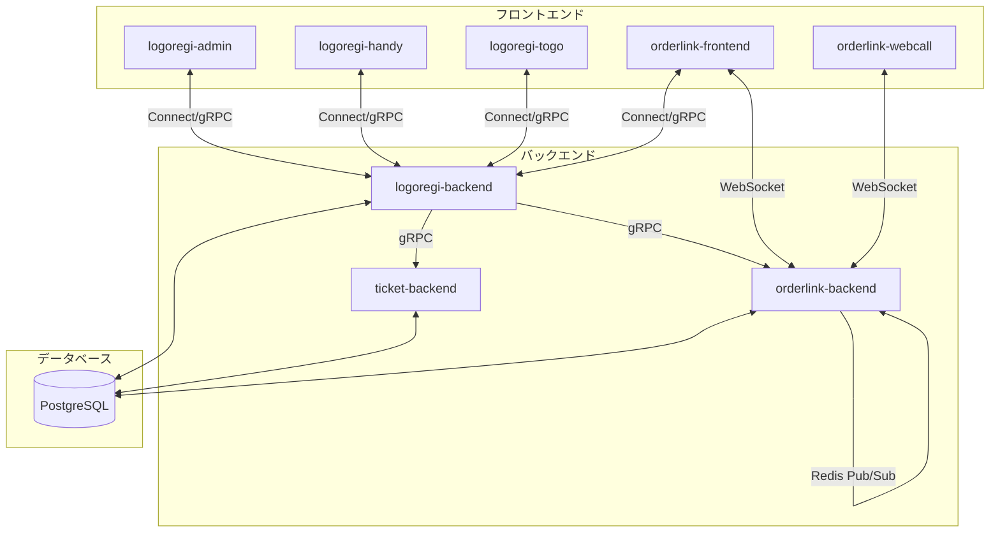
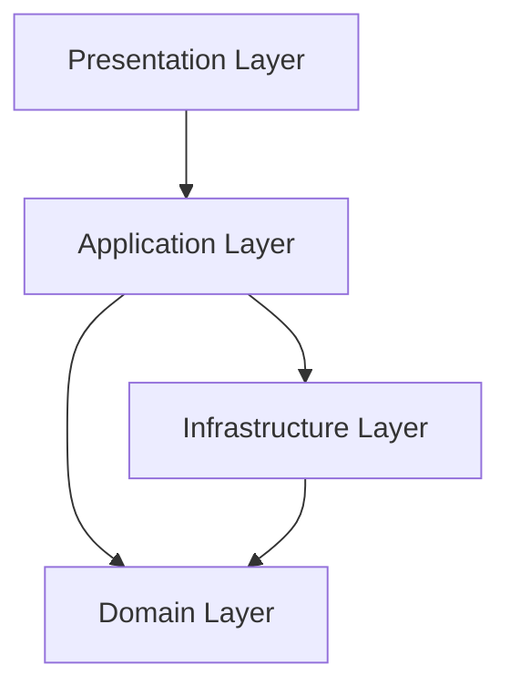
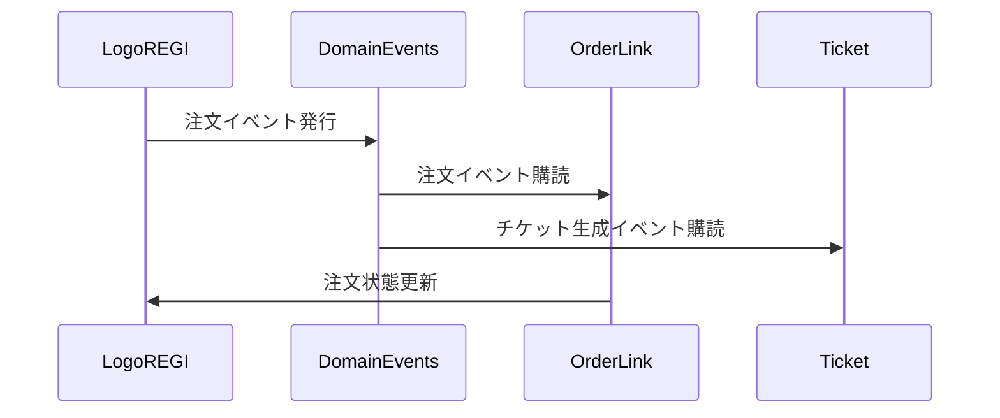

# LogosOne 全体アーキテクチャ

## 概要

LogosOneはカフェロゴス専用のPOSシステムとして設計されたMonorepoプロジェクトです。複数のサービスが同一リポジトリで管理されており、各サービスが連携して機能します。

## システム構成図



## アーキテクチャの特徴

LogosOneは、マイクロサービスアーキテクチャとモノレポの組み合わせを採用しています。この組み合わせにより、各サービスの独立性を保ちながらも、コードの再利用や一貫した開発環境の維持が可能になっています。

### 採用した設計パターン

1. **マイクロサービスアーキテクチャ**
   - 各サービス（logoregi-backend、orderlink-backend、ticket-backendなど）が特定の責務を持つ
   - サービス間の独立性が高く、個別にスケーリングや開発が可能
   - gRPCを介したサービス間通信により、型安全な連携を実現

2. **モノレポ構成**
   - すべてのサービスが単一のリポジトリで管理されている
   - 共通のコード、設定、開発ツールを共有
   - 一貫した開発環境とCI/CDパイプラインの提供

3. **ドメイン駆動設計（DDD）**
   - ビジネスドメインに焦点を当てた設計
   - 明確に定義されたドメインモデルとビジネスルール
   - ユビキタス言語の使用によるコードとビジネスの一致

4. **オニオンアーキテクチャ**
   - 関心の分離と依存関係の適切な方向付け
   - 内側（ドメイン）から外側（インフラ）への依存方向
   - テスト容易性と保守性の向上

## バックエンドアーキテクチャ

バックエンドサービスは、オニオンアーキテクチャとDDDの原則に従って設計されています。



### レイヤー構造

1. **ドメインレイヤー**
   - ビジネスロジックとルールの中核
   - エンティティ、値オブジェクト、リポジトリインターフェースを含む
   - ドメインサービスによる複雑なビジネスロジックの実装

2. **アプリケーションレイヤー**
   - ユースケースの実装
   - ドメインサービスと外部インターフェースの調整
   - トランザクション境界の定義

3. **インフラストラクチャレイヤー**
   - データベースアクセス、外部サービスとの連携
   - リポジトリインターフェースの実装
   - 技術的な詳細の抽象化

4. **プレゼンテーションレイヤー**
   - API（gRPC/HTTP）エンドポイントの提供
   - リクエストのバリデーションと応答のフォーマット
   - クライアントとの通信インターフェース

### 依存性の流れ

依存関係は外側から内側に向かって流れます：

1. プレゼンテーションレイヤーはアプリケーションレイヤーに依存
2. アプリケーションレイヤーはドメインレイヤーに依存
3. インフラストラクチャレイヤーもドメインレイヤーに依存

これにより、ドメインレイヤーが外部の変更から保護され、コアビジネスロジックの安定性が保たれます。

## フロントエンドアーキテクチャ

フロントエンドアプリケーションは、Next.jsとTypeScriptを基盤として、コンポーネント指向アーキテクチャを採用しています。

### アーキテクチャの特徴

1. **コンポーネント指向設計**
   - 再利用可能なUIコンポーネントの作成
   - 責務の明確な分離と単一責任の原則の適用
   - コンポーネント階層による関心の分離

2. **型安全性**
   - TypeScriptによる静的型チェック
   - バックエンドとの型共有（gRPC/Connect経由）
   - 実行時エラーの予防

3. **状態管理**
   - Jotaiによるアトミックな状態管理（logoregi-handyとlogoregi-togo）
   - ローカルコンポーネント状態とグローバル状態の適切な使い分け

4. **データフェッチング**
   - Connect-queryを使用したバックエンドとの通信
   - カスタムフックによるAPIロジックの抽象化

### ディレクトリ構造

フロントエンドアプリケーションは、機能ごとにモジュール化されたディレクトリ構造を持ちます：

```
app/
  (base)/    # 基本レイアウトと共通コンポーネント
    page.tsx    # ルートページ
    layout.tsx  # 基本レイアウト
    _components/  # 共通コンポーネント
    products/     # 商品管理モジュール
    orders/       # 注文管理モジュール
  (handy)/   # モバイル向けハンディ端末用コンポーネント
  providers.tsx  # グローバルプロバイダー
  layout.tsx     # アプリ全体のレイアウト
components/
  ui/       # 共通UIコンポーネント
query/     # バックエンドAPIとの通信ロジック
jotai/     # グローバル状態管理
```

## マイクロサービス連携

サービス間の連携は、複数の通信メカニズムを組み合わせて実現しています。

### 通信メカニズム

1. **gRPC/Connect-Go**
   - バックエンドサービス間の同期通信
   - フロントエンドとバックエンド間の通信
   - 型安全なAPIコントラクト

2. **WebSocket**
   - リアルタイム通知
   - orderlink-frontendとorderlink-backend間の双方向通信
   - 注文状態の変更通知

3. **Redis Pub/Sub**
   - 非同期メッセージング
   - イベントベースの通信
   - マイクロサービス間の状態同期

### イベント駆動アーキテクチャ

サービス間の疎結合は、イベント駆動アーキテクチャによって強化されています：



このイベント駆動アプローチにより、各サービスは他のサービスの内部実装を知ることなく連携できます。

## インフラストラクチャ

LogosOneは、以下のインフラストラクチャコンポーネントに依存しています：

1. **PostgreSQL**
   - 永続データストレージ
   - 各サービスが独自のスキーマを管理

2. **Redis**
   - メッセージングとキャッシング
   - Pub/Subによるイベント配信

3. **Docker Compose**
   - 開発環境と本番環境の構築
   - サービスの分離とスケーリング

## 開発者フロー

LogosOneの開発フローは以下のステップで構成されています：

1. ローカル開発環境のセットアップ（Docker Compose）
2. コードの変更とローカルテスト
3. CI/CDパイプラインによる自動テストと検証
4. デプロイ（Cloud Run）

このフローにより、一貫した開発経験と安定したデプロイプロセスが提供されます。
