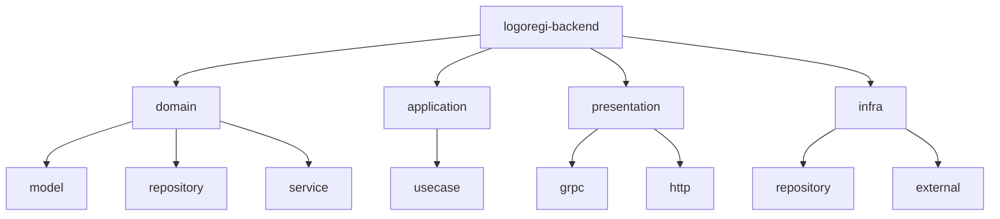
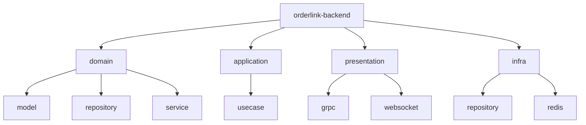
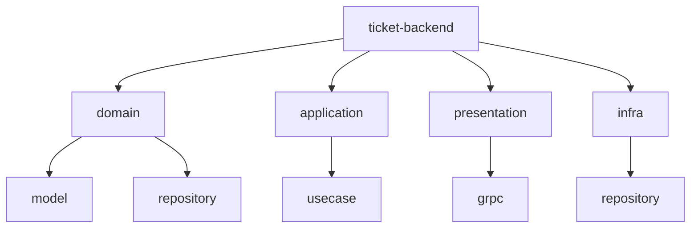
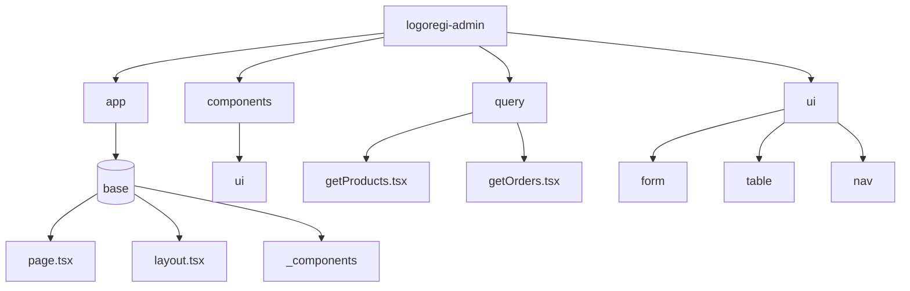
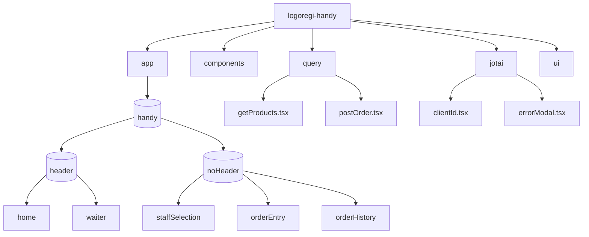
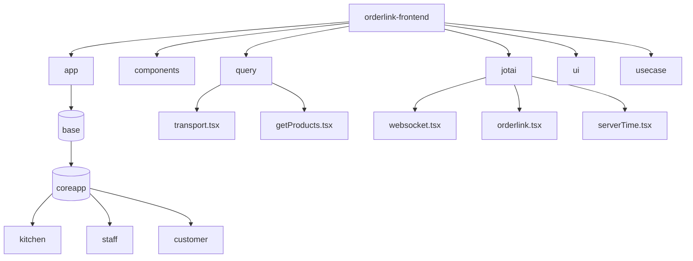
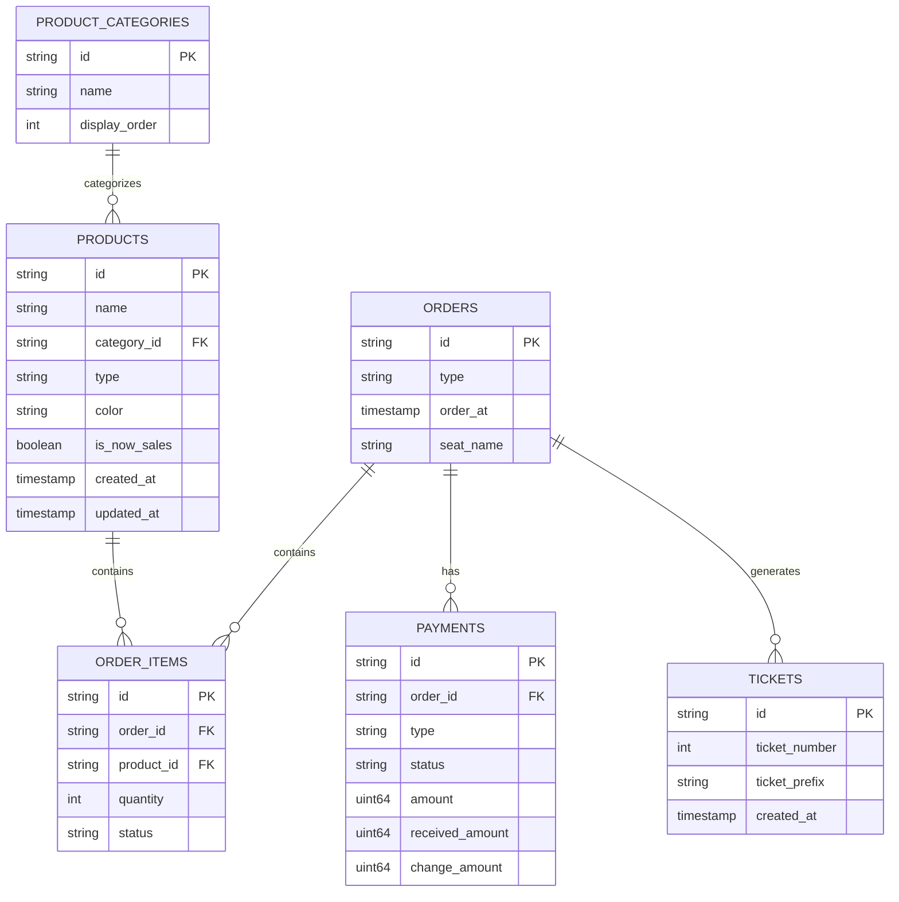

# LogosOne コンポーネント詳細

## 概要

LogosOneは複数のマイクロサービスで構成されており、各コンポーネントが特定の責務を持ちます。このドキュメントでは、各コンポーネントの詳細と役割について説明します。

## バックエンドコンポーネント

### logoregi-backend

POSシステムの中核となるバックエンドサービスです。



#### 主要機能

1. **商品管理**
   - 商品情報の登録・更新・削除
   - 商品カテゴリの管理
   - 在庫管理

2. **注文処理**
   - 注文の作成と管理
   - 注文アイテムの追加・削除
   - 注文の検索と取得

3. **支払い処理**
   - 現金決済処理
   - Square決済連携
   - 割引適用

4. **座席管理**
   - 座席情報の登録・更新
   - 座席ごとの注文管理

#### 技術スタック

- Go 1.21
- gRPC/Connect-Go
- PostgreSQL (uptrace/bun)
- Redis

#### 主要ドメインモデル

```go
// 商品モデル
type Product struct {
    productId       string
    ProductName     ProductName
    ProductCategory ProductCategory
    ProductType     ProductType
    Color           string
    IsNowSales      bool
    createdAt       synchro.Time[tz.UTC]
    updatedAt       synchro.Time[tz.UTC]
    // Only Coffee
    CoffeeBean  *CoffeeBean
    CoffeeBrews []*ProductCoffeeBrew
    // Only Other
    amount uint64
    Stock  *Stock
    // Only Admin
    IsManagingOrder bool
    IsOlUseKitchen  bool
}
```

### orderlink-backend

注文管理と調理状況追跡を担当するバックエンドサービスです。



#### 主要機能

1. **注文状態管理**
   - 注文状態の追跡
   - 状態変更の処理
   - 状態変更通知

2. **リアルタイム通信**
   - WebSocketによる双方向通信
   - イベント発行と購読
   - クライアント接続管理

3. **注文フィルタリング**
   - 商品カテゴリによるフィルタリング
   - 状態によるフィルタリング
   - 時間範囲によるフィルタリング

#### 技術スタック

- Go 1.21
- WebSocket
- Redis Pub/Sub
- PostgreSQL (uptrace/bun)

#### 主要ドメインモデル

```go
// 注文モデル
type Order struct {
    id         string
    orderItems []orderitem.OrderItem
    orderAt    synchro.Time[tz.UTC]
    orderType  OrderType
    status     OrderStatus
    seatName   *string
}
```

### ticket-backend

チケット発行と管理を担当するバックエンドサービスです。



#### 主要機能

1. **チケット発行**
   - チケット番号の生成
   - チケットプレフィックスの管理
   - チケット情報の保存

2. **チケット検索**
   - チケット番号による検索
   - 日付範囲による検索

#### 技術スタック

- Rust
- tonic (gRPC)
- PostgreSQL (sqlx)
- chrono

#### 主要ドメインモデル

```rust
// チケットモデル
pub struct Ticket {
    id: TicketId,
    ticket_number: usize,
    ticket_prefix: String,
    created_at: DateTime<Utc>,
}
```

## フロントエンドコンポーネント

### logoregi-admin

管理者向けダッシュボードを提供するフロントエンドアプリケーションです。



#### 主要機能

1. **商品管理**
   - 商品の登録・編集・削除
   - カテゴリ管理
   - 在庫管理

2. **注文履歴**
   - 注文履歴の表示
   - 注文詳細の確認
   - 注文検索

3. **売上分析**
   - 日別売上
   - 商品別売上
   - 支払い方法別売上

4. **設定管理**
   - 座席設定
   - 割引設定
   - コーヒー豆設定

#### 技術スタック

- Next.js
- TypeScript
- ChakraUI v3
- Connect-query

### logoregi-handy

店員用のモバイルPOSアプリケーションを提供するフロントエンドです。



#### 主要機能

1. **注文入力**
   - 商品選択
   - 数量指定
   - オプション選択

2. **支払い処理**
   - 現金支払い
   - カード決済
   - 割引適用

3. **注文履歴**
   - 未払い注文の表示
   - 注文詳細の確認
   - 注文検索

#### 技術スタック

- Next.js
- TypeScript
- ChakraUI v3
- Jotai
- Connect-query

### orderlink-frontend

キッチンディスプレイシステムとスタッフ向け注文管理インターフェースを提供するフロントエンドです。



#### 主要機能

1. **キッチンディスプレイ**
   - 注文表示
   - 調理状態管理
   - フィルタリング

2. **スタッフ向け注文管理**
   - 完成注文の表示
   - 提供管理
   - 通知

3. **カスタマーディスプレイ**
   - 注文状態表示
   - 完成通知
   - 待ち時間表示

#### 技術スタック

- Next.js
- TypeScript
- ChakraUI v3
- Jotai
- WebSocket

## データベース設計

LogosOneは、PostgreSQLをメインデータベースとして使用しています。各サービスは独自のスキーマを持ちますが、一部のデータは共有されています。

### 主要テーブル



## 開発環境

LogosOneの開発環境は、Docker Composeを使用して構築されています。

```yaml
# compose.yml
services:
  db:
    image: postgres:16
    ports:
      - '5432:5432'
    volumes:
      - db-data:/var/lib/postgresql/data
      - ./init/postgres:/docker-entrypoint-initdb.d
    environment:
      - POSTGRES_PASSWORD=password
  redis:
    image: redis:7
    ports:
      - '6379:6379'
    volumes:
      - redis-data:/data
  ticket-backend:
    build:
      context: ./ticket-backend
    ports:
      - '8081:8081'
    environment:
      - DATABASE_URL=postgres://postgres:password@db/ticket?sslmode=disable
      - PORT=8081

volumes:
  db-data:
  redis-data:
```

### 開発ツール

1. **Aqua**
   - ツールバージョン管理
   - Go、Rust、Node.jsなどのバージョン管理

2. **Bun**
   - フロントエンドのパッケージマネージャー
   - 高速なビルドとテスト

3. **Biome**
   - コードフォーマッターとリンター
   - TypeScriptとJavaScriptのコード品質管理

## デプロイメント

LogosOneは、以下の方法でデプロイされます：

1. **バックエンドサービス**
   - Google Cloud Run
   - Dockerコンテナ

2. **フロントエンドアプリケーション**
   - Vercel
   - Next.js最適化

3. **データベース**
   - Google Cloud SQL (PostgreSQL)
   - マネージドサービス

4. **キャッシュとメッセージング**
   - Google Cloud Memorystore (Redis)
   - マネージドサービス

## 監視とロギング

LogosOneは、以下の方法で監視とロギングを行います：

1. **アプリケーションロギング**
   - 構造化ログ
   - ログレベルによる分類

2. **メトリクス収集**
   - リクエスト数
   - レスポンスタイム
   - エラーレート

3. **アラート**
   - 異常検知
   - エラー通知

## セキュリティ

LogosOneは、以下のセキュリティ対策を実装しています：

1. **認証と認可**
   - JWTベースの認証
   - ロールベースのアクセス制御

2. **データ保護**
   - 転送中の暗号化（TLS）
   - 保存データの暗号化

3. **入力検証**
   - リクエストバリデーション
   - SQLインジェクション対策
