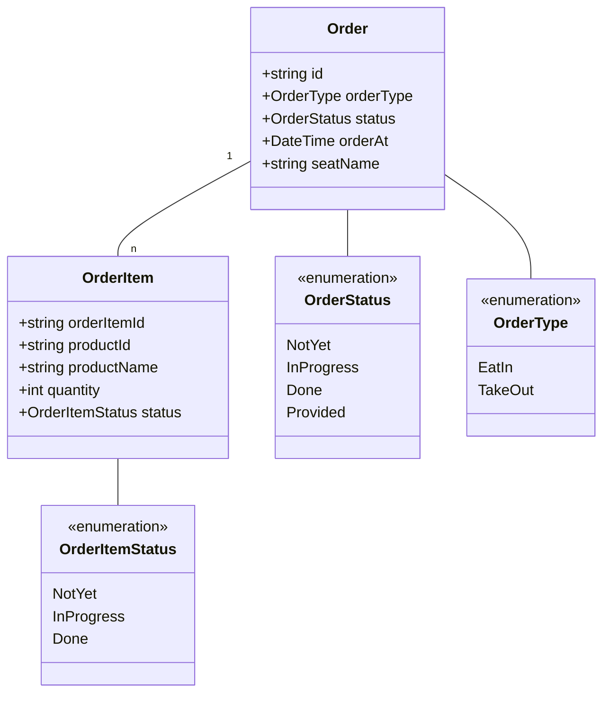
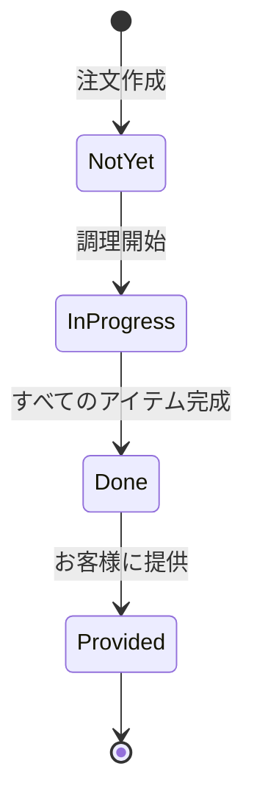
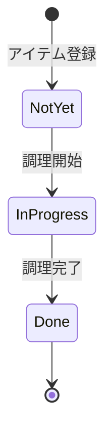
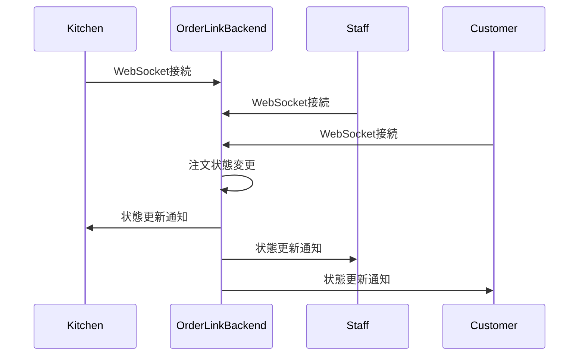

# LogosOne 注文管理機能

## 概要

LogosOneの注文管理機能は、注文のライフサイクル全体を管理します。この機能は主にorderlink-backendサービスによって提供され、注文の受付から完了までのプロセスを追跡し、リアルタイムで関係者に通知します。

## 主要機能

1. **注文のライフサイクル管理**
   - 注文の受付
   - 調理ステータスの追跡
   - 完成通知
   - 提供管理

2. **リアルタイム通知**
   - キッチンへの注文通知
   - 注文状態変更の通知
   - スタッフへの完成通知

3. **表示システム**
   - キッチンディスプレイシステム
   - スタッフモニター
   - カスタマーモニター

4. **データ分析と可視化**
   - 注文処理時間の分析
   - ピーク時の効率分析
   - 商品別の注文頻度

## ドメインモデル

注文管理の中核となるドメインモデルは以下の通りです：



### 主要エンティティ

1. **Order（注文）**
   - 注文の基本情報を管理
   - 注文タイプ（EatIn, TakeOut）
   - 注文状態（未着手、進行中、完了、提供済み）
   - 注文日時
   - 座席情報（イートインの場合）

2. **OrderItem（注文アイテム）**
   - 注文内の個々の商品項目
   - 商品情報（ID、名前）
   - 数量
   - 状態（未着手、調理中、完了）

## 注文状態遷移

注文管理では、注文全体と個々の注文アイテムの両方に状態遷移があります。

### 注文全体の状態遷移



### 注文アイテムの状態遷移



## 状態遷移の実装

注文とアイテムの状態は、ドメインモデル内で明示的に管理されています。状態遷移のルールはドメインロジックとして実装されており、不正な状態遷移を防止します。

```go
// 注文状態の更新（orderlink-backend/domain/model/order/order.go）
func (o *Order) UpdateStatus(status OrderStatus) error {
    // 状態遷移の検証
    if status != Provided && uint(o.status)+1 != uint(status) && uint(o.status)-1 != uint(status) {
        return domain.ErrCantOperationOrderStatus
    }
    o.status = status
    return nil
}
```

この実装により、注文状態は順序通りにしか変更できず、例えば「未着手」から直接「完了」に変更することはできません。

## WebSocketによるリアルタイム通知

注文状態の変更は、WebSocketを通じてリアルタイムで関係者に通知されます。



### WebSocket実装

WebSocket通信は、以下のコンポーネントで構成されています：

1. **WebSocketハンドラー**
   - クライアント接続の管理
   - メッセージのルーティング

2. **イベントパブリッシャー**
   - 注文状態変更イベントの発行
   - 接続クライアントへのブロードキャスト

3. **クライアントマネージャー**
   - 接続クライアントの追跡
   - クライアントタイプ（キッチン、スタッフ、カスタマー）の管理

## キッチンディスプレイシステム

キッチンディスプレイシステム（KDS）は、調理スタッフに注文情報をリアルタイムで表示します。

### 主要機能

1. **注文表示**
   - 新規注文のリアルタイム表示
   - 優先順位に基づく注文のソート
   - 調理時間の表示

2. **状態管理**
   - 調理開始ボタン
   - 調理完了ボタン
   - 注文アイテムごとの状態管理

3. **フィルタリング**
   - 商品カテゴリによるフィルタリング
   - 状態によるフィルタリング

### UI実装

キッチンディスプレイのUIは、orderlink-frontendサービスによって提供されます。このUIは、以下のコンポーネントで構成されています：

1. **注文リスト**
   - 現在の注文を表示
   - 経過時間を表示

2. **アイテム詳細**
   - 商品名、数量、オプション
   - 調理指示

3. **状態変更ボタン**
   - 調理開始/完了ボタン
   - 状態表示

## スタッフ向け注文管理

スタッフ向けの注文管理インターフェースは、注文の提供状況を管理します。

### 主要機能

1. **注文一覧**
   - 完成済み注文の表示
   - 提供待ち注文の表示

2. **提供管理**
   - 提供完了ボタン
   - 座席情報の表示

3. **通知**
   - 新規完成注文の通知
   - 長時間待ちの注文のハイライト

## カスタマーディスプレイ

カスタマーディスプレイは、お客様に注文状況をリアルタイムで表示します。

### 主要機能

1. **注文番号表示**
   - 現在調理中の注文番号
   - 完成済み注文番号

2. **状態表示**
   - 調理中
   - 完成（呼び出し中）

3. **待ち時間表示**
   - 予想待ち時間
   - 経過時間

## 注文データ分析

注文データは分析のために保存され、以下の情報を提供します：

1. **処理時間分析**
   - 注文から完成までの平均時間
   - 商品別の調理時間

2. **ピーク時分析**
   - 時間帯別の注文量
   - スタッフ配置の最適化

3. **商品分析**
   - 人気商品ランキング
   - 組み合わせ分析

## エラーハンドリング

注文管理機能では、以下のエラーケースに対応しています：

1. **通信エラー**
   - WebSocket接続の切断
   - 再接続メカニズム

2. **状態同期エラー**
   - クライアント状態の不一致
   - 強制再同期メカニズム

3. **ユーザーエラー**
   - 不正な操作の防止
   - 確認ダイアログ

## テスト戦略

注文管理機能のテストは、以下のレベルで実施されています：

1. **単体テスト**
   - ドメインロジックの検証
   - 状態遷移ルールのテスト

2. **統合テスト**
   - WebSocket通信のテスト
   - イベント発行と購読のテスト

3. **エンドツーエンドテスト**
   - 実際の注文フローのテスト
   - 複数クライアント間の同期テスト
