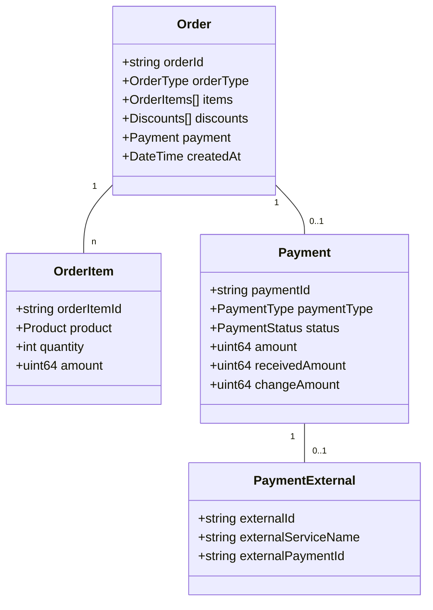
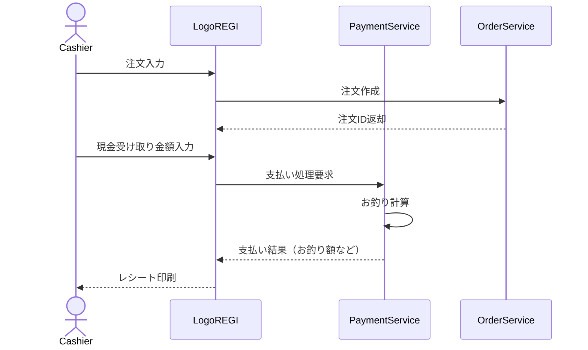
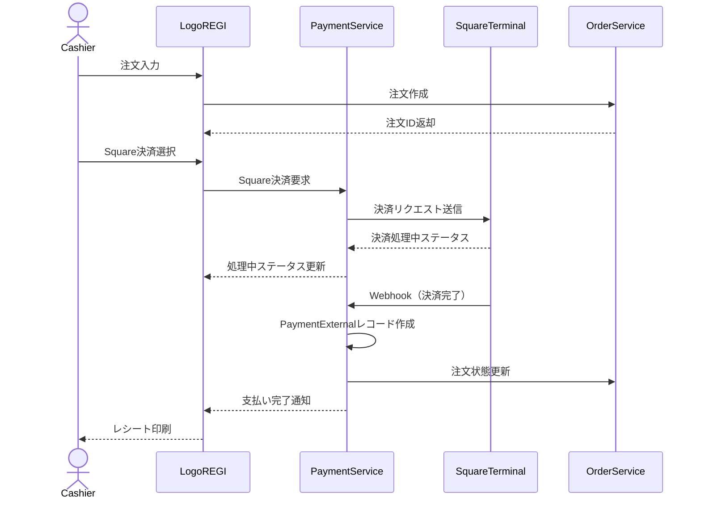

# LogosOne 会計機能

## 概要

LogosOneの会計機能は、POS（Point of Sale）システムの中核として、注文の受付から支払い処理までのフローを管理します。この機能はlogoregi-backendサービスによって提供され、Square決済端末との統合も実現しています。

## 主要機能

1. **注文の受付と会計**
   - 商品の選択と注文入力
   - 注文の編集と確認
   - 支払い処理（現金、クレジットカード）
   - レシート発行

2. **座席管理（イートイン）**
   - 後払いのためのオーダー登録
   - 座席ごとの注文履歴表示
   - 座席間の注文移動

3. **支払い方法**
   - 現金支払い
   - Square端末を通じたクレジットカード決済
   - 割引適用

4. **釣銭準備金管理**
   - 営業開始時の準備金登録
   - 営業終了時の点検

## ドメインモデル

会計機能の中核となるドメインモデルは以下の通りです：



### 主要エンティティ

1. **Order（注文）**
   - 注文の基本情報を管理
   - OrderType（EatIn, TakeOut）で注文タイプを区別
   - 注文に含まれる商品アイテムのコレクションを保持
   - 割引情報を保持

2. **OrderItem（注文アイテム）**
   - 注文内の個々の商品を表現
   - 商品情報、数量、金額を管理

3. **Payment（支払い）**
   - 支払い方法（現金、カード）
   - 支払い状態（未払い、処理中、完了、キャンセル）
   - 支払い金額、受取金額、お釣り

4. **PaymentExternal（外部支払い）**
   - Square決済などの外部決済サービスとの連携情報
   - 外部決済IDの管理

## 支払いフロー

### 現金支払いフロー



### Square決済フロー



## 実装詳細

### 支払いサービス

支払い処理を担当するドメインサービスは、以下の責務を持ちます：

1. 支払い方法に応じた処理のルーティング
2. 支払い金額の検証（注文合計と一致するか）
3. お釣りの計算
4. 外部決済サービスとの連携

```go
// 実装例（ドメインサービス）
type PaymentService interface {
    ProcessCashPayment(ctx context.Context, orderId string, receivedAmount uint64) (*Payment, error)
    RequestSquarePayment(ctx context.Context, orderId string, amount uint64) (*Payment, error)
    CompleteExternalPayment(ctx context.Context, externalPaymentId string) error
    CancelPayment(ctx context.Context, paymentId string) error
}
```

### Square統合

Square決済端末との統合は、以下のコンポーネントで構成されています：

1. **Square外部サービスアダプター**
   - Square APIとの通信
   - 決済リクエストの送信

2. **Webhookハンドラー**
   - Square決済イベントの受信
   - 決済状態の更新

3. **決済状態管理**
   - 決済の進行状況の追跡
   - タイムアウトと失敗処理

Square決済は非同期プロセスとして実装されており、Webhookを通じて決済結果が通知されます。これにより、決済端末での処理中もPOSシステムは他の操作を続行できます。

## エラーハンドリング

会計機能では、以下のエラーケースに対応しています：

1. **注文検証エラー**
   - 商品の在庫不足
   - 商品の価格変更

2. **支払いエラー**
   - 決済金額の不一致
   - 外部決済の失敗
   - 決済タイムアウト

3. **システムエラー**
   - データベース接続エラー
   - 外部サービス連携エラー

各エラーケースに対して、明示的なエラータイプと処理フローが定義されています。

## テスト戦略

会計機能のテストは、以下のレベルで実施されています：

1. **単体テスト**
   - ドメインロジックの検証
   - バリデーションのテスト

2. **統合テスト**
   - リポジトリとデータベースの連携テスト
   - 外部サービスの模擬テスト

3. **エンドツーエンドテスト**
   - 一般的な支払いフローのテスト
   - エラーケースのハンドリングテスト
